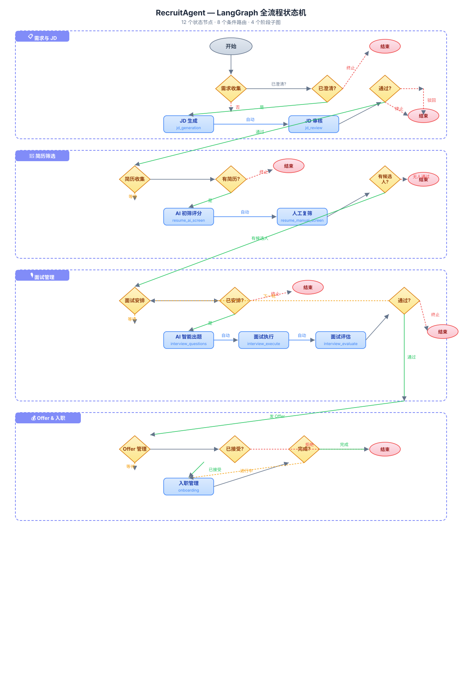
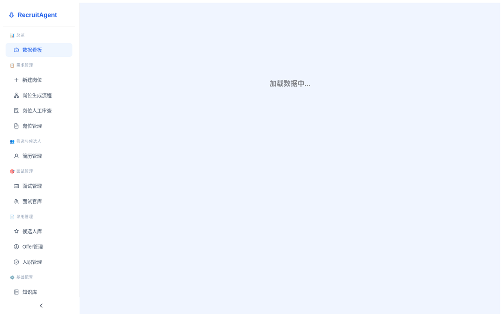
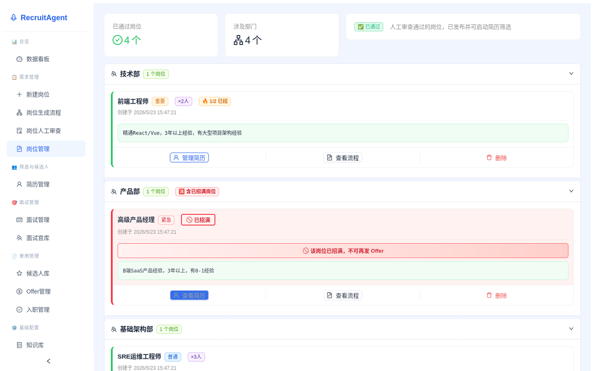
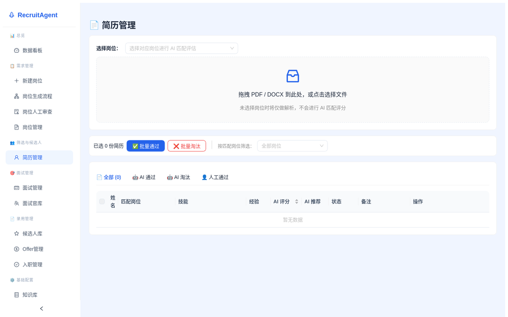
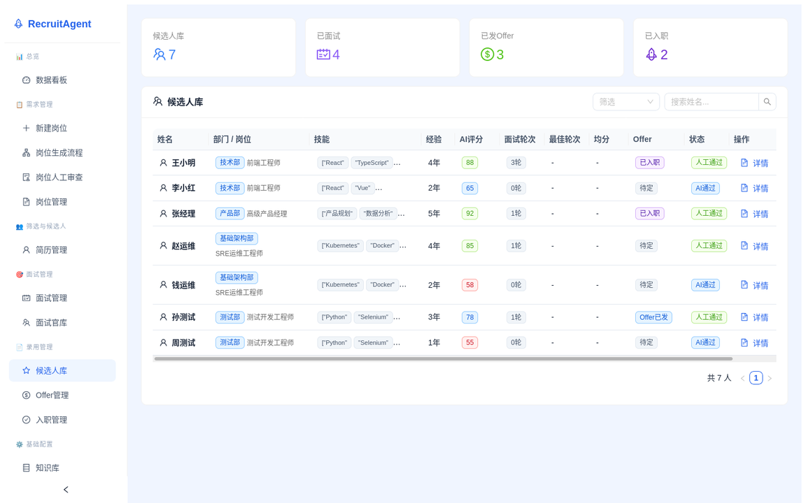
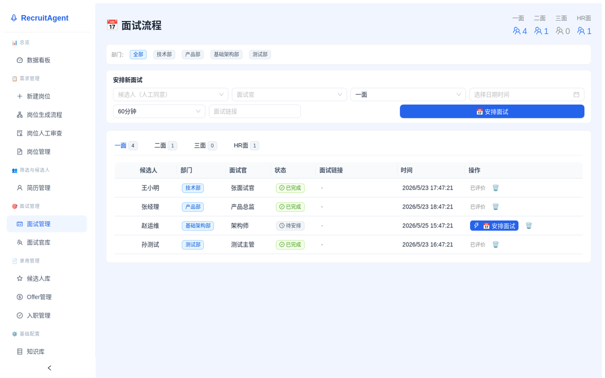
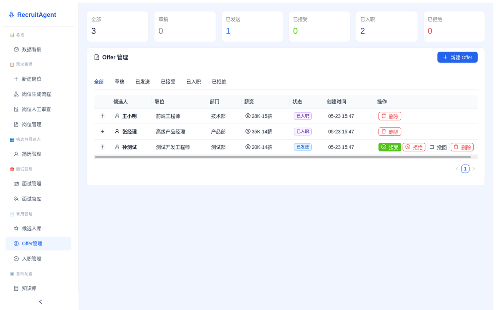
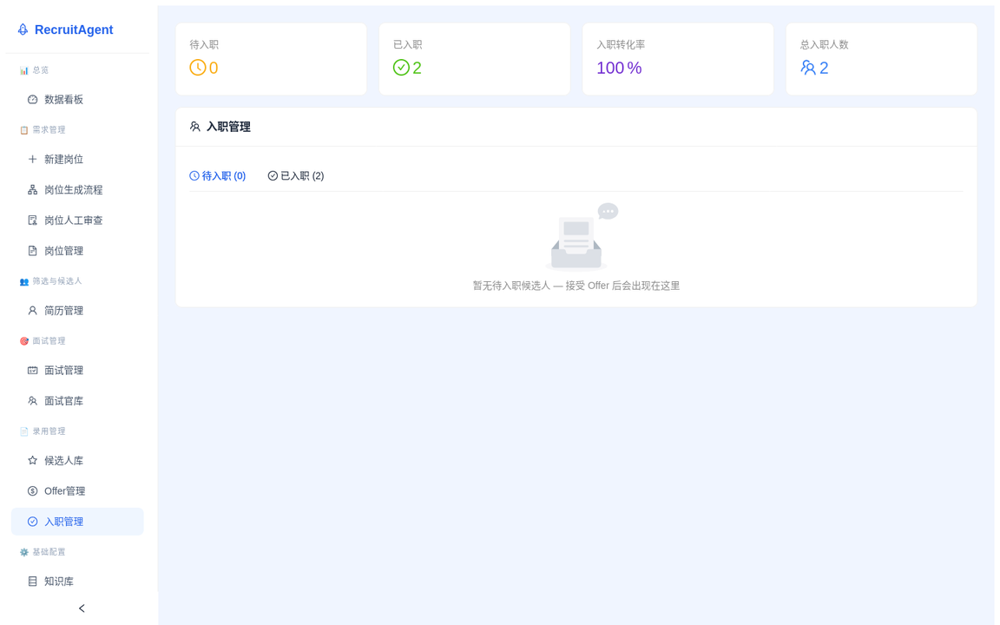

<p align="center">
  
  
  
  
  
  
</p>

<h1 align="center">🤖 RecruitAgent — 全流程招聘智能体</h1>

<p align="center">
  <b>基于 LangGraph 状态机的 AI 招聘助手</b><br>
  <i>需求收集 → JD生成 → 简历筛选 → 面试管理 → Offer → 入职，AI 贯穿全链路</i>
</p>

<p align="center">
  <a href="#-功能亮点">功能亮点</a> •
  <a href="#-架构设计">架构设计</a> •
  <a href="#-截图预览">截图预览</a> •
  <a href="#-技术栈">技术栈</a> •
  <a href="#-快速开始">快速开始</a> •
  <a href="#-项目结构">项目结构</a>
</p>

<br>

---

## 🏗️ LangGraph 工作流

> **12 个状态节点 · 8 个条件路由 · 4 个阶段子图** — 每个节点都是独立的工作单元，条件边驱动状态自动流转。

<p align="center">
  
</p>

<br/>

---

## ✨ 功能亮点

<table>
<tr>
  <td width="50%">
    <h3>📋 智能岗位管理</h3>
    <ul>
      <li>AI 辅助 JD 生成与多轮需求澄清</li>
      <li>基于 RAG 的知识库增强</li>
      <li>岗位名额自动管控，防止超额发 Offer</li>
      <li>可视化工作流引擎，状态一目了然</li>
    </ul>
  </td>
  <td width="50%">
    <h3>📄 AI 简历筛选</h3>
    <ul>
      <li>支持 PDF/DOCX 多格式简历上传</li>
      <li>AI 自动评分：技能40% / 经验30% / 教育15% / 契合度15%</li>
      <li>≥60 分自动进入候选池</li>
      <li>按岗位匹配筛选 + 行内编辑</li>
    </ul>
  </td>
</tr>
<tr>
  <td width="50%">
    <h3>🎙️ 面试管理流水线</h3>
    <ul>
      <li>一面 → 二面 → 三面 → HR面 全流程管理</li>
      <li>AI 自动出题（基于简历 + JD）</li>
      <li>AI 辅助评价草稿生成</li>
      <li>快速通过 / 详细评估双模式</li>
    </ul>
  </td>
  <td width="50%">
    <h3>💰 Offer & 入职管理</h3>
    <ul>
      <li>草稿 → 发送 → 接受 → 入职全链路</li>
      <li>候选人去重：有 Offer 的不可重复选择</li>
      <li>岗位名额智能拦截</li>
      <li>入职流程跟踪，从 Offer 到正式员工</li>
    </ul>
  </td>
</tr>
</table>

<br>

## 🏗️ 架构设计

> **LangGraph 状态机** 驱动招聘全流程，每个阶段都是一个独立的状态节点，支持条件跳转和人工干预。

### 核心设计原则

| 原则 | 说明 |
|:---|:---|
| **状态机驱动** | 每一步都是确定性的状态转移，便于审计和回溯 |
| **AI 增强而非替代** | AI 负责评分、出题、草稿，关键决策由人把控 |
| **双重校验** | 后端 + 前端双重拦截，防止业务规则被绕过 |
| **渐进式复杂度** | 简单场景直通，复杂场景条件跳转 |

<br>

## 📸 截图预览

> 所有页面均基于真实数据展示，支持亮色/暗色 4 套主题切换 🎨

<table>
<tr>
  <td align="center"><b>📊 数据看板</b></td>
  <td align="center"><b>📋 岗位管理</b></td>
</tr>
<tr>
  <td></td>
  <td></td>
</tr>
<tr>
  <td align="center"><b>📄 简历管理</b></td>
  <td align="center"><b>👤 候选人库</b></td>
</tr>
<tr>
  <td></td>
  <td></td>
</tr>
<tr>
  <td align="center"><b>🎙️ 面试流水线</b></td>
  <td align="center"><b>💰 Offer 管理</b></td>
</tr>
<tr>
  <td></td>
  <td></td>
</tr>
<tr>
  <td align="center" colspan="2"><b>🚀 入职管理</b></td>
</tr>
<tr>
  <td colspan="2" align="center"></td>
</tr>
</table>

<br>

## 🛠️ 技术栈

<table>
<tr>
  <th>层级</th>
  <th>技术</th>
  <th>说明</th>
</tr>
<tr>
  <td>🧠 <b>工作流引擎</b></td>
  <td>LangGraph + SqliteSaver</td>
  <td>状态机驱动，持久化检查点，支持中断/恢复</td>
</tr>
<tr>
  <td>⚙️ <b>后端</b></td>
  <td>FastAPI + SQLAlchemy + SQLite</td>
  <td>异步 HTTP API，ORM 映射，零配置数据库</td>
</tr>
<tr>
  <td>🤖 <b>AI 引擎</b></td>
  <td>DeepSeek v4 Flash</td>
  <td>JD 增强、简历评分、面试出题、评价草稿</td>
</tr>
<tr>
  <td>🎨 <b>前端</b></td>
  <td>React 18 + TypeScript + Ant Design 5</td>
  <td>响应式 UI，4 套主题，类型安全</td>
</tr>
<tr>
  <td>📦 <b>构建</b></td>
  <td>Vite 6</td>
  <td>秒级 HMR，快速构建</td>
</tr>
<tr>
  <td>📄 <b>文档解析</b></td>
  <td>PyMuPDF + python-docx</td>
  <td>PDF/DOCX 简历解析</td>
</tr>
</table>

<br>

## 🚀 快速开始

### 前置条件

- Python 3.11+
- Node.js 18+
- 一个 LLM API Key（兼容 OpenAI 格式，如 DeepSeek）

### 1. 🖥️ 后端

```bash
cd backend
python -m venv .venv
source .venv/bin/activate
pip install -r requirements.txt

# 配置 API Key
cp .env.example .env
# 编辑 .env，填入你的 LLM_API_KEY

# 启动服务（自动创建数据库）
uvicorn app.main:app --host 0.0.0.0 --port 8000 --reload
```

> 后端启动后，访问 `http://localhost:8000/docs` 可查看 Swagger 文档

### 2. 🌐 前端

```bash
cd frontend
npm install
npm run dev
```

> 打开 `http://localhost:5173` 即可使用 🎉

### 3. 🧪 生成测试数据（可选）

```bash
cd backend
python seed_fresh.py
```

<br>

## 📁 项目结构

```
recruit-agent/
├── backend/                        # FastAPI 后端
│   ├── app/
│   │   ├── main.py                # 入口 & 路由注册
│   │   ├── config.py              # 配置管理
│   │   ├── database.py            # SQLAlchemy 数据库引擎
│   │   ├── models/                # 数据模型（SQLAlchemy ORM）
│   │   ├── routers/               # API 路由模块
│   │   │   ├── jd.py              # JD 增删改查
│   │   │   ├── resumes.py         # 简历上传/列表
│   │   │   ├── candidates.py      # 候选人管理
│   │   │   ├── interviews.py      # 面试管理 + 流水线
│   │   │   ├── interviewers.py    # 面试官管理
│   │   │   ├── offers.py          # Offer 管理 + 名额校验
│   │   │   ├── onboarding.py      # 入职管理
│   │   │   ├── workflow.py        # LangGraph 工作流
│   │   │   └── kb.py              # 知识库
│   │   ├── schemas/               # Pydantic 请求/响应模型
│   │   ├── services/              # 业务逻辑层
│   │   │   ├── llm_service.py     # LLM API 调用
│   │   │   ├── jd_service.py      # JD 生成/增强
│   │   │   ├── resume_analyzer.py # 简历 AI 分析
│   │   │   ├── document_parser.py # 文档解析
│   │   │   ├── vector_store.py    # 向量存储
│   │   │   └── storage.py         # 文件存储
│   │   └── workflows/             # LangGraph 工作流定义
│   │       ├── graph.py           # 主工作流图
│   │       ├── graph_jd.py        # JD 子工作流
│   │       ├── graph_screening.py # 简历筛选工作流
│   │       └── nodes/             # 工作流节点
│   ├── requirements.txt           # Python 依赖
│   └── .env.example               # 环境变量模板
├── frontend/                       # React 前端
│   └── src/
│       ├── api/                   # API 封装
│       ├── components/            # 通用组件
│       │   ├── EmptyGuide.tsx     # 空状态引导
│       │   └── ErrorBoundary.tsx  # 错误边界
│       ├── pages/                 # 页面组件
│       │   ├── Dashboard.tsx      # 数据看板
│       │   ├── JDManage.tsx       # 岗位管理
│       │   ├── ResumeManage.tsx   # 简历管理
│       │   ├── CandidatesManage.tsx # 候选人库
│       │   ├── InterviewManage.tsx # 面试流水线
│       │   ├── OfferManage.tsx    # Offer 管理
│       │   ├── OnboardingManage.tsx # 入职管理
│       │   └── ...                # 更多页面
│       ├── types.ts               # TypeScript 类型定义
│       └── themes.ts              # 4 套主题配置
├── screenshots/                    # 页面截图（README 用）
├── docs/                           # 文档
└── scripts/                        # 工具脚本
```

<br>

## 🔍 核心功能详解

### 📋 岗位管理

- **AI 对话式需求收集**：智能提问引导需求澄清，支持多轮交互
- **RAG 增强 JD 生成**：基于知识库的历史 JD 增强生成
- **多级审查流程**：AI 生成 → 人工审核 → 发布
- **名额自动管控**：`_check_jd_headcount_filled` 双重校验，防止超额 Offer

### 📄 简历管理

- **多格式支持**：PDF / DOCX 自动解析
- **AI 评分体系**：`技能(40%) + 经验(30%) + 教育(15%) + 契合度(15%)`
- **双阶段筛选**：AI 初审（`ai_pass`）→ 人工复审（`manual_pass`）
- **智能匹配**：简历自动关联目标岗位，支持行内编辑

### 🎙️ 面试管理

- **流水线视图**：每个轮次独立看板，清晰展示面试流转
- **智能出题**：AI 根据简历 + JD 生成个性化面试题
- **双模式评估**：
  - ⚡ **快速通过**：一键通过面试，自动创建下一轮
  - 📝 **详细评估**：AI 协助打分 + 评语，人工确认
- **历史评价追溯**：面试详情页展示所有前序轮次评价

### 💰 Offer & 入职管理

- **状态流转**：`DRAFT → SENT → ACCEPTED → ONBOARDED`
- **候选人去重**：已有 Offer 的候选人自动排除
- **岗位拦截**：名额已满时拦截新 Offer 创建
- **入职跟踪**：从 Offer 接受到正式入职的全流程管理

<br>

## 📝 许可证

[MIT](LICENSE)

---

<p align="center">
  <sub>Built with ❤️ using LangGraph · FastAPI · React · Ant Design</sub>
</p>
